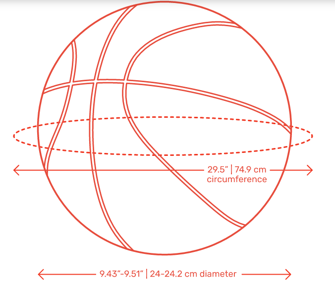
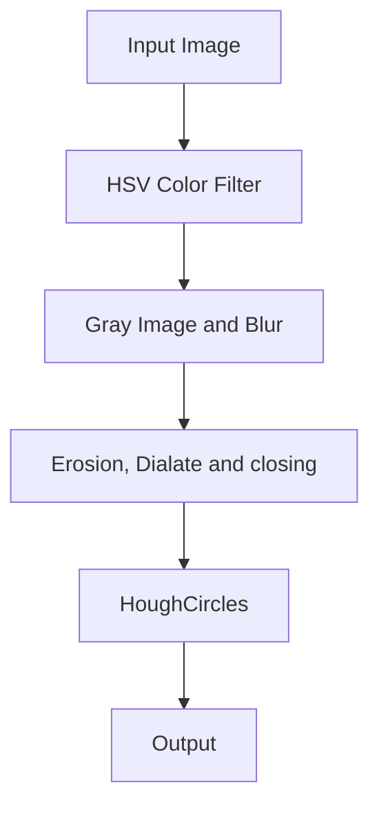
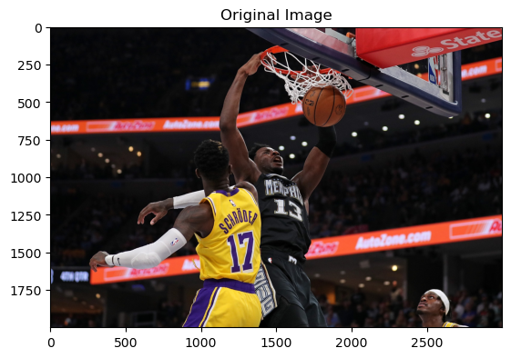
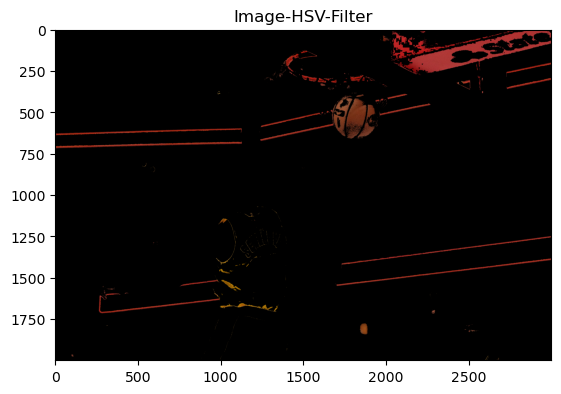
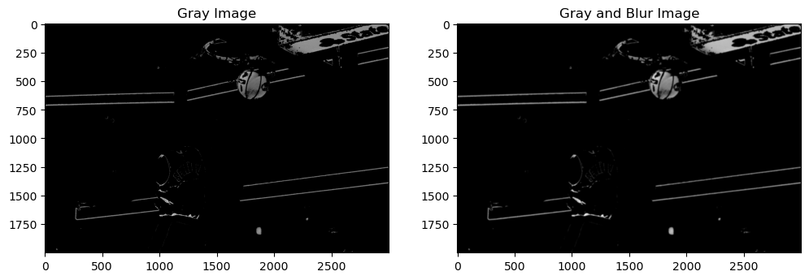
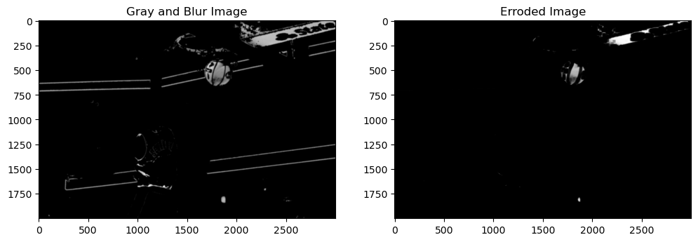
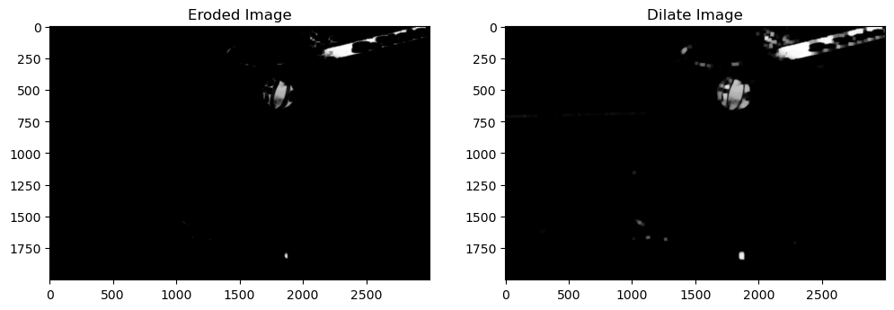
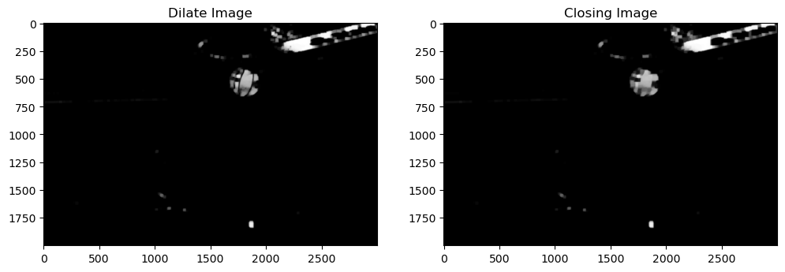
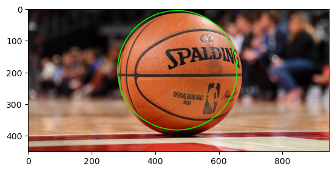
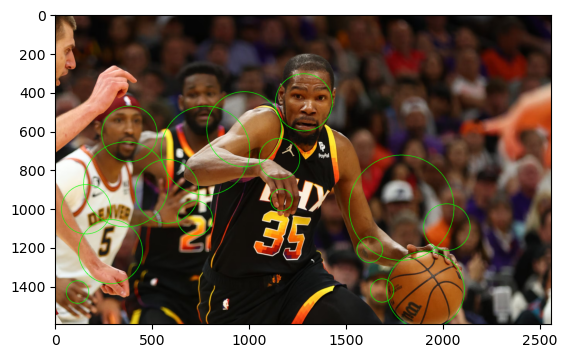

# Object Detection, Tracking of Basketballs

## Failure Experience:

1. cv2.HoughCircles only find object with ball shape, but there are many similar objects in the real world can be
   classified as ball object

## A. Basket ball features

### A1. General feautures

- shape: ball / circle
- color: organge

### A2. Minor features

- line: black_line
- size in real world: 12-12.1 cm radius

  

## B. Solutions

1. HSV Color Filter
2. Gray Image and Blur
3. Erosion, Dialate and
   closing: [Reference link](https://opencv24-python-tutorials.readthedocs.io/en/latest/py_tutorials/py_imgproc/py_morphological_ops/py_morphological_ops.html)
4. HoughCircles

## C. Diagram



## C. Implementation

### Import required libraries

```python
import cv2
import numpy as np
import matplotlib.pyplot as plt
```

### C1. Read Original Image

```python
im = cv2.imread("data\\png_ball1.png")
im_original = cv2.cvtColor(im, cv2.COLOR_BGR2RGB)
plt.title("Original Image")
plt.imshow(im_original)
plt.show()
```



### C2. HSV Color Filter

```python
im_hsv = cv2.cvtColor(im, cv2.COLOR_BGR2HSV)
# take only the orange, highly saturated, and bright parts
# im_hsv = cv2.inRange(im_hsv, (7, 180, 180), (11, 255, 255))
im_hsv = cv2.inRange(im_hsv, (0, 150, 100), (20, 255, 200))

# To show the detected orange parts:
im_orange = im.copy()
im_orange[im_hsv == 0] = 0
plt.title("Image-HSV-Filter")
plt.imshow(cv2.cvtColor(im_orange, cv2.COLOR_BGR2RGB))
plt.plot()
```



### C3. Gray Image and Gaussian Blur

```python
im_gray = cv2.cvtColor(im_orange, cv2.COLOR_BGR2GRAY)
ksize = (10, 10)
im_gray_blur = cv2.blur(im_gray, ksize)
plt.figure(figsize=(12, 6))
plt.subplot(121)
plt.title("Gray Image")
plt.imshow(im_gray, cmap="gray")
plt.subplot(122)
plt.title("Gray and Blur Image")
plt.imshow(im_gray_blur, cmap="gray")
plt.show()
```



### C4. Erosion, Dialate and closing

Erosion:

```python
kernel = np.ones((21, 21), np.uint8)
erosion = cv2.erode(im_gray_blur, kernel, iterations=1)

plt.figure(figsize=(12, 6))
plt.subplot(121)
plt.title("Gray and Blur Image")
plt.imshow(im_gray_blur, cmap="gray")

plt.subplot(122)
plt.title("Erroded Image")
plt.imshow(erosion, cmap="gray")
plt.show()
```



Dialate:

```python
kernel = np.ones((11, 11), np.uint8)
dilate = cv2.dilate(erosion, kernel, iterations=2)

plt.figure(figsize=(12, 6))
plt.subplot(121)
plt.title("Eroded Image")
plt.imshow(erosion, cmap="gray")

plt.subplot(122)
plt.title("Dilate Image")
plt.imshow(dilate, cmap="gray")
plt.show()
```



Closing:

```python
kernel = np.ones((21, 21), np.uint8)
closing = cv2.morphologyEx(dilate, cv2.MORPH_CLOSE, kernel)

plt.figure(figsize=(12, 6))
plt.subplot(121)
plt.title("Dilate Image")
plt.imshow(dilate, cmap="gray")

plt.subplot(122)
plt.title("Closing Image")
plt.imshow(closing, cmap="gray")
plt.show()
```




C5. Detection: HoughCircles

```python
im_copy = im.copy()
circles = cv2.HoughCircles(closing, cv2.HOUGH_GRADIENT, 1, 50,
                                   param1=50, param2=30, minRadius=10, maxRadius=300)

if circles is not None:
    circles = np.round(circles[0, :]).astype("int")
    for (x, y, r) in circles:

        cv2.circle(im_copy, (x, y), r, (0, 255, 0), 2)

# Display the processed frame
# cv2.imshow('Ball Detection', img)
plt.imshow(cv2.cvtColor(im_copy, cv2.COLOR_BGR2RGB))
```


## D. Testing and Evaluation
### D1. Detect a ball in a image



### D2. Detect a ball in a complex image

