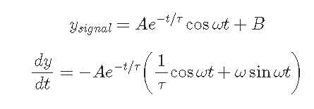
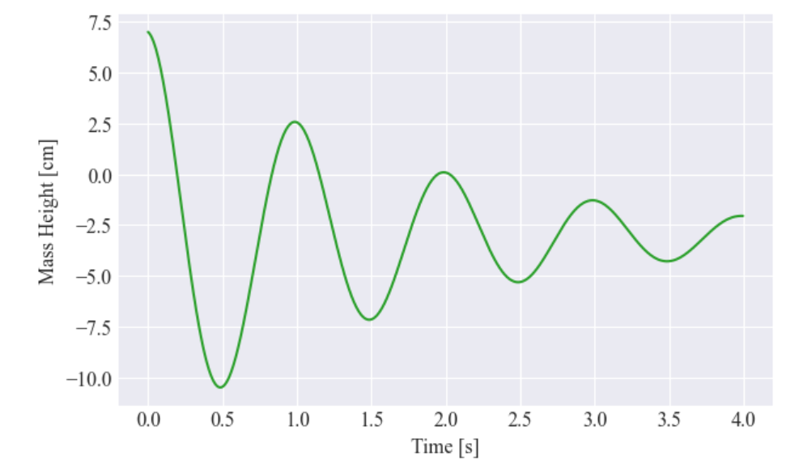
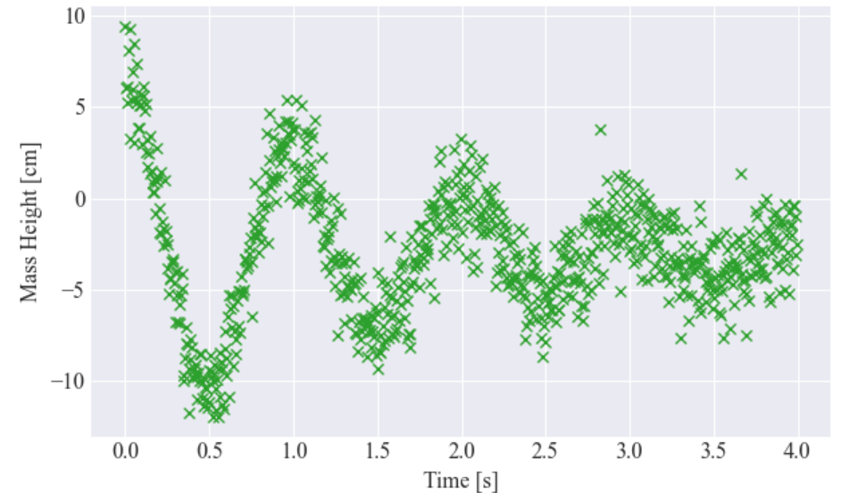
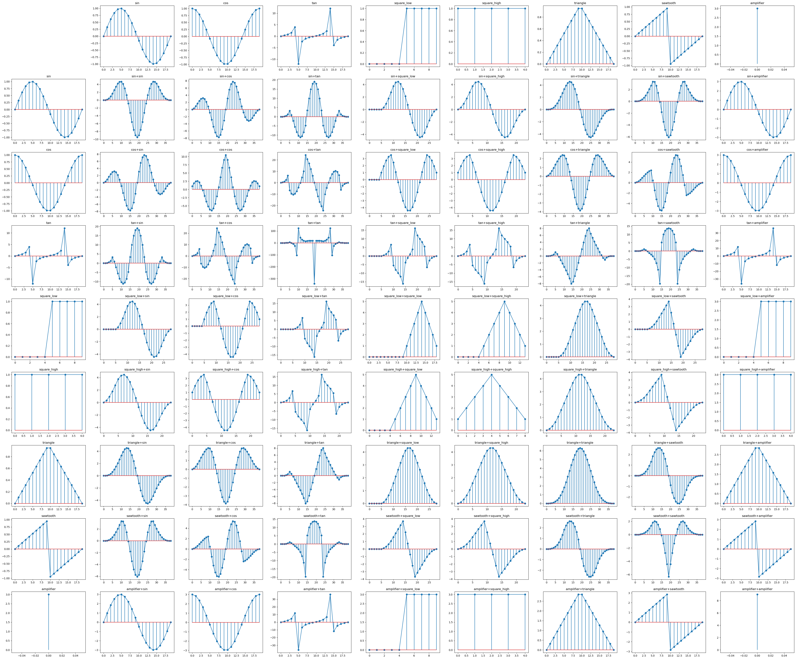

# A.Introduction

In the machine learning, you may need to preprocess you data before inputing them into designed model to enhance
accuracy. One of the most common preprocessing method is smoothing noisy data. In this article, I will introduce you a
method called Savitzy-Golay (Savgol) filter.

# B. Savitzy-Golay (Savgol) filter

## B1. Code Highlight

After checking the library function of Savgol filter, I found that the default model is `interp` and it is implemented
by convolution.

```python
coeffs = savgol_coeffs(window_length, polyorder, deriv=deriv, delta=delta)

if mode == "interp":
    if window_length > x.size:
        raise ValueError("If mode is 'interp', window_length must be less "
                         "than or equal to the size of x.")

    # Do not pad. Instead, for the elements within `window_length // 2`
    # of the ends of the sequence, use the polynomial that is fitted to
    # the last `window_length` elements.
    y = convolve1d(x, coeffs, axis=axis, mode="constant")
    _fit_edges_polyfit(x, window_length, polyorder, deriv, delta, axis, y)
```

## B2. Parameters

- `window_length`: the length of the filter window (i.e. the number of coefficients). `window_length` must be a positive
  odd integer. If `mode` is 'interp', `window_length` must be less than or equal to the size of `x`.
- `polyorder`: the order of the polynomial used to fit the samples. `polyorder` must be less than `window_length`.

Our example is using polynomial of order 2 and window length of 51.

# C. Methodology

## C1. Example signal

Decaying sinusoid with DC offset with given equation:


Graph:


Graph with noise:


Expected Result:

--> x refer to the signal

Please refer to the following link for more details:
https://en.wikipedia.org/wiki/Savitzky%E2%80%93Golay_filter#Derivation_of_convolution_coefficients

# References:

- [Original Article](https://medium.com/python-in-plain-english/my-favorite-way-to-smooth-noisy-data-with-python-bd28abe4b7d0)
- [Convolution - Youtube](https://www.youtube.com/watch?v=KuXjwB4LzSA)

# Inspirations:

We can use convolution to smooth noisy data. The idea is to use a window of size n, and then take the average of the
data points in the window. The window then moves to the right by one data point, and the process repeats. The result is
a smoothed curve.

One of usage of convolution is to calculate the product of two very large numbers, according to Youtube.

# Common Convolution Wave Graph:

