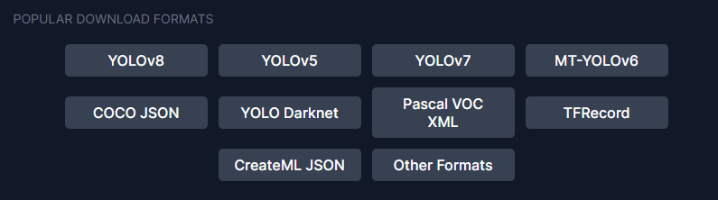
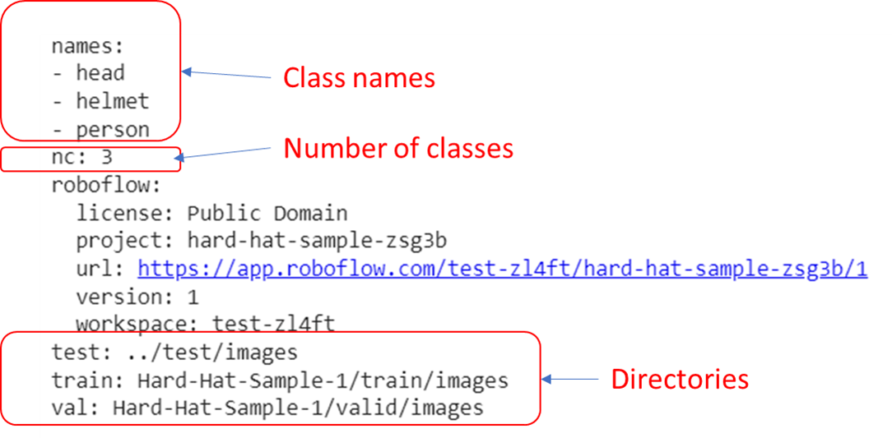

# A. Installation

1. Clone the Yolo-v5 repository from github

```shell
!git clone https://github.com/ultralytics/yolov5
%cd yolov5/
```

2. Install necessary libraries for Yolo-V5 training

- Use requirements.txt to install all required libraries quickly with following command

```
!pip install -qr requirements.txt
```

- Common libraries for deep learning
    - torch: a standrad deep learning library lauched by Facebook
    - scipy: libray for scientific studies. Some tools such as Matrix calculation
    - pandas: DataFrame library. Package data to a frame and display information easily
    - numpy: sub-library in scipy.
    - matplotlib.pyplot: Display library with graph

3. Check the setup

```python
import torch

from IPython.display import Image, clear_output  # to display images
from utils.downloads import attempt_download  # to download models/datasets

# clear_output()
print('Setup complete. Using torch %s %s' % (
    torch.__version__, torch.cuda.get_device_properties(0) if torch.cuda.is_available() else 'CPU'))
```

It will output the cuda version of your computer. It is not important information for training but usually give you
correct version if the current environment is avaible.

# B. Deploy training data to Roboflow

Roboflow works like Google Image but it is a platform to help you process and transfer images to the formated image of
machine learning.

Alternatively, you can use below tools to reduce costs of trainng

- [CVAT](https://www.cvat.ai/)
- [LabelImg](https://viso.ai/computer-vision/labelimg-for-image-annotation/#:~:text=LabelImg%20is%20a%20straightforward%20and,files%20in%20PASCAL%20VOC%20format.)
- [VOTT](https://learn.microsoft.com/en-us/dotnet/machine-learning/how-to-guides/label-images-for-object-detection-using-vott)

Although Roboflow will make your training easy, number of images / training data is limited. We may consider to use
other tools to cut down the costs. However, we will use Roboflow to store training data at current stage because it
greatly improve develop experience.

## Download your training data with python code
1. Install roboflow
```shell
!pip install -q roboflow
```
2. Direct to your data location
```shell
%cd /content/yolov5
```
3. Run the python code to download formated data
```python
from roboflow import Roboflow
rf = Roboflow(api_key="{api_secret}")
project = rf.workspace("{workspace}").project("{project_name}")
# This line will define what type of data you want to down from roboflow
dataset = project.version(1).download("yolov5")
```

In this example, you can use some official data provided by [Roboflow Data](https://public.roboflow.com/)

Different formats provided by Roboflow



4. Check your downloaded data
```shell
%cat {dataset.location}/data.yaml
```

"data.yaml" is a file to tell the system how to import images and labels from the directories



Modify this template if you are using other tools to process training images
```yaml
names:
- head
- helmet
- person
nc: 3
test: ../test/images
train: Hard-Hat-Sample-1/train/images
val: Hard-Hat-Sample-1/valid/images
```

