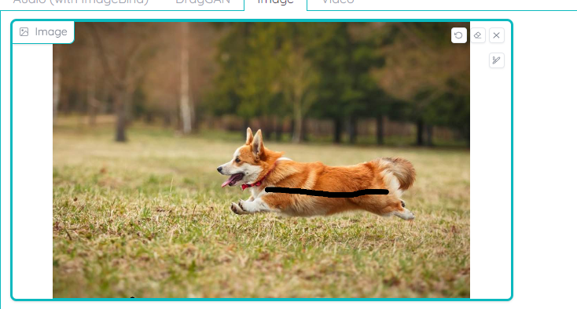
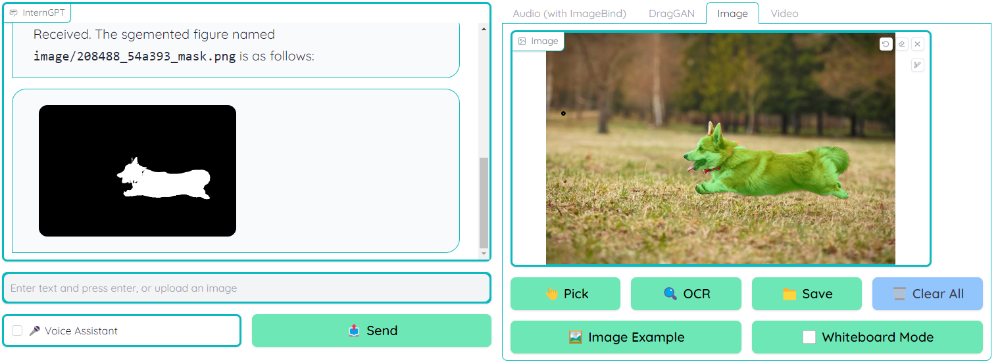
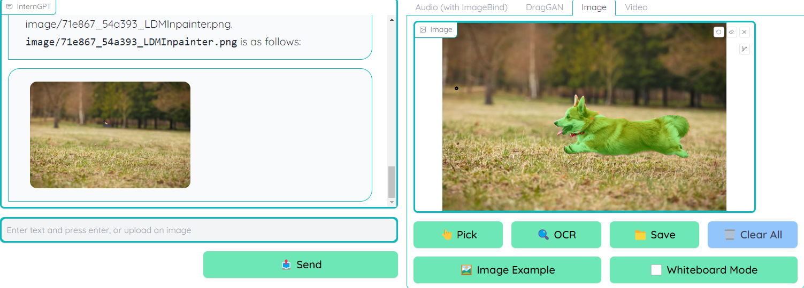
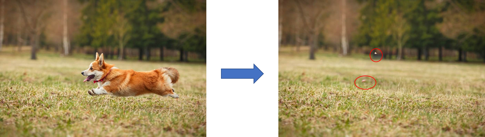

# Background

InternGPT is a pointing-language-driven visual interactive system which allows you to send images as input for GPT
model. There are some basic functions should be supported by this project including click, drag and draw.

# Investigation

## A. Click

1. Draw a line to point some image objects in the photo
   

2. Click the pick button to select the object
   After processing, you are able to see the output mask image in the message box, supprsingly, the system can bound the
   image with high accuracy
   

3. Send some commands (only natural language is required) to the message prompt and see the result

e.g. remove the dog in the image



### Evaluation

Some unwanted details are still remained in the output image, but it can be improved in the further model.


## B. Drag

1. Clone and Installation

```shell
git clone https://github.com/Zeqiang-Lai/DragGAN.git
cd DragGAN
conda create -n draggan python=3.7
conda activate draggan
pip install -r requirements.txt
```

2. Launch the server

```shell
# if you have a Nvidia GPU
python gradio_app.py
# if you use m1/m2 mac
python gradio_app.py --device mps
# otherwise
python gradio_app.py --device cpu
```

### Result

Unfortunately, I am not able to drag the image in the system due to the lack of GPU. Eventhough I have tried to use the
demo website provided by official develop team, it always gives me errors after running the model.

DraGAN is still in the development stage, it is not stable enough to use in the production environment. So, I will wait
for a stable version to test this function.

## C. Draw

# References

1. [Original Paper](https://arxiv.org/pdf/2305.05662.pdf)
2. [InternGPT Github](https://github.com/OpenGVLab/InternGPT)
3. [DraGAN Github](https://github.com/Zeqiang-Lai/DragGAN)